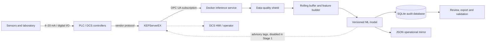

# 09 — Macro integration architecture

## Purpose

The solution is an advisory measurement and forecasting layer. It observes the
plant, validates the incoming information, calculates a result and stores it.
It does not replace regulatory control, safety logic or the operator.

## Plant-to-user architecture

## Services and responsibilities

| Layer | Service/component | Input | Output | Failure behavior |
|---|---|---|---|---|
| Physical | Sensors, analyzer and laboratory | Process | Electrical/digital readings | PLC/DCS remains responsible for safe operation |
| Control | PLC / DCS | Field I/O | Controlled tags | Continues independently of ML |
| Translation | Kepware | Vendor protocols | OPC UA address space | ML disconnects and retries; control is unaffected |
| Transport | OPC UA | Timestamped tags and quality codes | Subscriptions | Bad quality or incoherent snapshots are rejected |
| Compute | Docker inference service | OPC snapshots | Advisory prediction and status | Restarts automatically; never writes control commands |
| Persistence | SQLite + JSON mirror | Predictions/events | Auditable local history | Storage failure blocks an unaudited advisory result |
| Presentation | HMI/dashboard/export | Prediction history | Human-readable information | Operator remains final decision-maker |

## Deployment stages

1. **CSV replay laboratory:** the simulator publishes historical rows through
   OPC UA; the inference service is tested without plant access.
2. **Kepware laboratory connection:** placeholder Node IDs are replaced and
   certificate, security and reconnect behavior are tested.
3. **Production shadow mode:** real tags are read, predictions are stored, but
   no result is shown as a control instruction.
4. **Advisory HMI:** approved result/status tags are displayed to operators.
5. **Operational validation:** plant and laboratory evidence determine whether
   the advisory is useful. Closed-loop control is outside this project scope.

## Network zones

- Kepware normally runs on an approved Windows OT host.
- Docker Desktop currently hosts the isolated prototype on Windows.
- Production routing, firewall ports, certificates and user identity require
  joint approval from IT/OT and control-system teams.
- The OPC UA endpoint is the only intended plant-facing interface.

