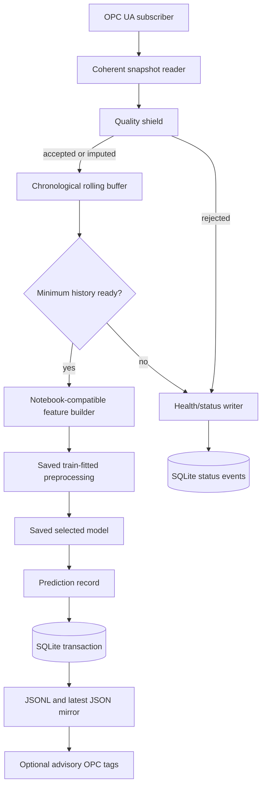

# 10 — Micro inference-service architecture

## Components inside the inference container



## One-minute processing sequence

1. Subscribe to the simulator/Kepware sequence tag instead of repeatedly
   polling every sensor.
2. Read the sequence, all mapped inputs and the sequence again. Accept the
   snapshot only when both sequence values agree.
3. Check OPC quality, timestamp order, cadence, impossible ranges and the share
   of missing required inputs.
4. Accept isolated missing sensor cells as `IMPUTED`; the saved training-fitted
   imputer and missingness indicators handle them. Reject a row when more than
   25% of required inputs are absent.
5. Append the accepted row to a bounded chronological buffer.
6. During initial warm-up, publish `WARMING_UP`; no fabricated history is used.
7. Build exactly the feature columns expected by the saved artifact and apply
   preprocessing fitted during model development—never refit live.
8. Run either `target_free` estimation or the explicitly configured
   `target_anchored` horizon forecast.
9. Commit the complete output to SQLite in one transaction.
10. Mirror the result to JSONL/latest JSON and, only when separately approved,
    write dedicated advisory tags. No control tag is ever written.

## Status state machine

```text
STARTING → CONNECTED → WARMING_UP → RUNNING
              ↑             ↓          ↓
              └──── reconnect ── DATA_ERROR
                         DISCONNECTED
```

Only status changes are stored as database events, avoiding one repeated event
per minute. `health.json` continues to expose the latest live state.

## Two supported operational contracts

| Mode | Required target input | Output timestamp | Intended use |
|---|---|---|---|
| `target_free` | None | Current source timestamp | Virtual measurement when free acid is unavailable |
| `target_anchored` | Fresh laboratory free acid and its measurement time | Source time + 1/5/10/15 min | Short-horizon warning anchored to a known level |

The manual laboratory result must not be treated as a continuously updated
online analyzer. The freshness rule therefore blocks stale target anchoring.

## Failure isolation

- A container, database or network failure does not stop PLC/DCS control.
- OPC disconnects trigger bounded reconnect attempts and clear the consistency
  buffer, followed by a new warm-up.
- Invalid data produces a visible status and no advisory prediction.
- SQLite is the authoritative Stage-1 audit store; JSON is a readable mirror.
- Production deployment should add certificate-based OPC UA security, managed
  secrets, centralized logs, backups and an approved retention policy.

