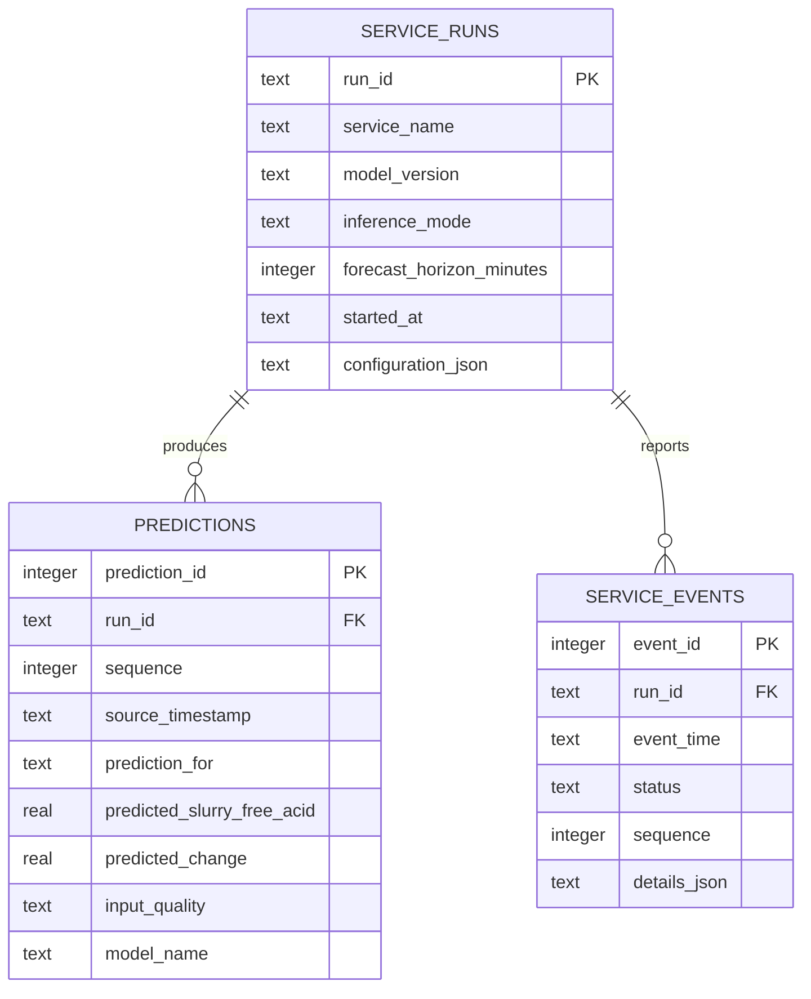

# 11 — SQLite output database

## Why SQLite is used in Stage 1

SQLite provides transactions, a schema, indexes and queries without operating
another database server. It is appropriate for one local inference writer and
supervisor demonstrations. It is not presented as the final plant historian.

Database file: `runtime/predictions.sqlite3`

## Data model



### `service_runs`

One row per inference-service startup. It records a UUID, mode, horizon, model
version, start time and a configuration snapshot.

### `predictions`

One row per successful prediction. `UNIQUE(run_id, sequence)` prevents duplicate
records within one run, while allowing a historical CSV to be replayed again in
a new run. Timestamps and quality are indexed for review.

### `service_events`

Stores state changes such as `STARTING`, `CONNECTED`, `WARMING_UP`, `RUNNING`,
`DATA_ERROR` and `DISCONNECTED` with explanatory details.

## Durability and access

- Transactions prevent partial prediction rows.
- WAL mode permits a reader while the inference service writes.
- The database is persisted through the Docker bind mount.
- JSONL remains available for simple tools and recovery comparison.
- Back up/copy the database only according to an agreed retention procedure.

## Commands

From `deployment/`:

```powershell
.\scripts\database_status.ps1
.\scripts\export_predictions.ps1
```

The export is written to `runtime/predictions_export.csv`. The database itself
should remain the audit source because CSV does not preserve relationships,
constraints or data types.

