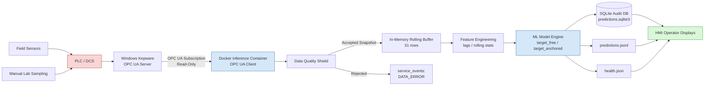
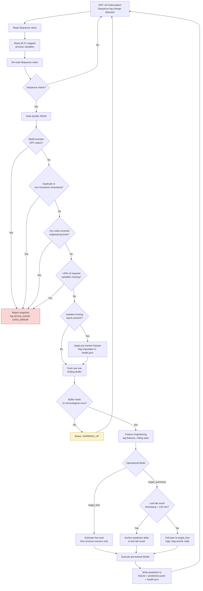
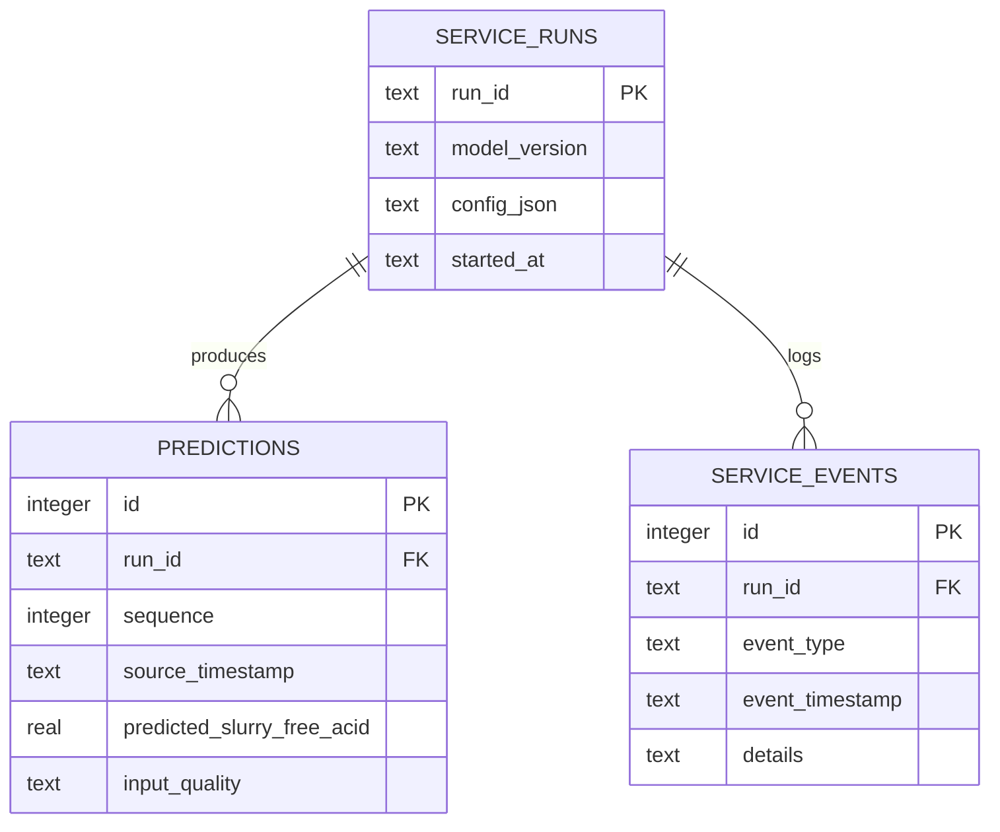

# Integration Architecture Document
## Advisory Virtual Measurement Service — SLURRY_FREE_ACID Estimation
### Triple Super Phosphate (TSP) Fertilizer Plant

**Document Type:** Macro & Micro Integration Architecture
**Classification:** Advisory / Read-Only System — No Control Authority

---

## Section 1: Executive Summary & Safety Boundaries

### 1.1 Purpose

This document specifies the end-to-end integration architecture of the industrial machine learning deployment that estimates `SLURRY_FREE_ACID` in the TSP reaction/digestion process. The service is a **virtual measurement (soft sensor)**: it consumes process data via OPC UA, computes an advisory estimate, and persists that estimate for human review. It does not, and cannot, act on plant equipment.

### 1.2 The Advisory-Only Boundary

The Advisory-Only boundary is the architectural line that separates the deterministic, safety-rated control domain (PLC/DCS) from the non-deterministic, advisory compute domain (the ML inference service). This boundary is enforced structurally, not just procedurally:

- **No actuator interface exists.** The Docker inference container holds an OPC UA **client** subscription that is configured for **read-only** access to the Kepware OPC UA server. No write-capable tags, methods, or node paths are exposed to the service, and no write client is instantiated anywhere in the `industrial_inference/` codebase.
- **One-way data flow.** Process values flow from PLC/DCS → Kepware → the inference container. Predictions flow from the inference container → SQLite/JSON → HMI display. There is no return path from the ML output back into the control network. The prediction is a number in a database and a JSON file; it has no mechanism to become a setpoint.
- **PLC/DCS retains absolute control authority.** All interlocks, permissives, closed-loop control, alarms, and safety instrumented functions continue to execute exactly as they did before this service existed, entirely within the DCS. The DCS does not query, wait for, or depend on the ML service in any control path. If the inference service is stopped, crashes, or is disconnected, the plant's control behavior is unaffected.
- **Degraded-mode is fail-silent, not fail-dangerous.** Every failure mode of the ML service (data quality rejection, warm-up, disconnection, model error) results in the service withholding or flagging a prediction — never in it emitting a fabricated or stale value silently. Section 3.4 details this state machine.
- **Human-in-the-loop by design.** The `SLURRY_FREE_ACID` estimate is presented to operators as a decision-support figure alongside the manual lab result it is meant to complement, not replace. Operators, not the model, make any resulting adjustment to blending, acid dosing, or feed rate through the existing DCS operator interface.

### 1.3 Why This Boundary Matters

TSP digestion chemistry is exothermic, corrosive, and safety-critical; free acid concentration directly affects reaction control and equipment integrity. A soft-sensor estimate is valuable because on-line free acid measurement is not continuously available (lab sampling is periodic), but the estimate is a statistical inference from correlated process variables, not a physical measurement. Treating it as a physical measurement — or worse, wiring it into a control loop — would introduce an unvalidated, non-deterministic signal into a safety-relevant process. The architecture below is designed so this boundary cannot be crossed by a configuration error alone: it requires deliberate re-architecture (adding a write path, adding a control integration) to change the trust level of this system.

---

## Section 2: Macro Integration Architecture (Plant-to-User)

### 2.1 End-to-End Data Flow



The red-tinted node (PLC/DCS) denotes the deterministic control domain. The blue-tinted nodes denote the advisory compute domain. There is no arrow returning from the compute domain into the control domain — this is the visual representation of the Advisory-Only boundary defined in Section 1.2.

### 2.2 Services and Layer Responsibilities

| Layer | Component | Inputs | Outputs | Fail-Safe Behavior |
|---|---|---|---|---|
| **Physical** | Field sensors (temperature, density, flow, pH-related instruments) and manual lab sampling | Physical process state | Raw analog/digital signal to PLC I/O; periodic lab result entry | Sensor fault reflected as PLC bad-quality tag; does not stop production |
| **Control** | PLC / DCS | Sensor signals, operator setpoints, lab entries | Deterministic control actions, alarms, interlocks; process values exposed to Kepware | Operates under its own safety logic regardless of ML service state; no dependency on inference container |
| **Translation** | Windows Kepware (OPC UA Server) | PLC/DCS tag values | OPC UA address space (Node IDs) with quality/timestamp metadata | On PLC comms loss, tag quality flips to Bad/Uncertain; server keeps last known value tagged accordingly rather than fabricating data |
| **Transport** | OPC UA Subscription (client in Docker container) | Node ID map (`config/opc_tags.yaml`), Sequence commit tag | Change notifications delivered to `industrial_inference` package | On subscription drop, client attempts reconnect with backoff; service transitions to `DISCONNECTED` state (Section 3.4) rather than reusing stale values |
| **Compute** | Docker Inference Container (`industrial_inference/`) | Coherent snapshots of 21 process variables + lab targets | Prediction record (`predicted_slurry_free_acid`), quality/status flags | Withholds prediction if Data Quality Shield rejects snapshot, buffer is `WARMING_UP`, or anchor lab result exceeds 120-minute staleness (target_anchored mode) |
| **Persistence** | SQLite (`runtime/predictions.sqlite3`) + JSON (`runtime/predictions.jsonl`, `runtime/health.json`) | Prediction + lifecycle events from Compute layer | Durable audit trail, machine-readable live status | Local disk write failure logged as a `service_events` entry; container continues serving `health.json` in-memory even if disk write fails |
| **Presentation** | HMI Operator Displays | `predictions.jsonl`, `health.json` | Visual advisory figure alongside manual lab trend, service health indicator | Displays explicit "advisory unavailable" / `WARMING_UP` / `DATA_ERROR` state rather than a blank or last-value display that could be mistaken for current |

---

## Section 3: Micro Inference Service Architecture (Inside Docker)

### 3.1 Internal Processing Pipeline



### 3.2 The Coherent Snapshot Mechanism

The subscriber never reads the 21 process variables in isolation, since PLC-side tag updates are not atomic from an OPC UA client's perspective — mid-update reads could mix values from two different plant states. Instead:

1. The client monitors a single `Sequence` commit tag (mapped in `config/opc_tags.yaml`).
2. On a change notification, it reads the current `Sequence` value.
3. It reads all 21 mapped inputs, laboratory targets, and sequence markers.
4. It re-reads `Sequence`.
5. The snapshot is accepted only if the sequence value read in step 2 equals the value read in step 4 — confirming the PLC did not commit a new state mid-read. A mismatch discards the snapshot and the subscriber waits for the next change notification rather than retrying immediately against a moving target.

### 3.3 Rolling Buffer Semantics

- The buffer requires exactly **31 chronological rows**: 30 historical minutes plus the current minute, matching the cadence defined in `config/service.yaml`.
- While the buffer holds fewer than 31 rows, status is `WARMING_UP` and no prediction is emitted — lag and rolling features are undefined below this depth.
- If a communication gap exceeds the configured tolerance (i.e., the PLC/OPC link stalls beyond an acceptable number of missed cadence cycles), the buffer history is cleared entirely and the service re-enters `WARMING_UP`, rather than bridging the gap with interpolated or stale rows that would corrupt lag features.

### 3.4 Operational State Machine

```
                ┌───────────┐
                │  STARTING │
                └─────┬─────┘
                      │ OPC UA session established
                      ▼
                ┌───────────┐
        ┌──────▶│ CONNECTED │
        │       └─────┬─────┘
        │             │ Coherent snapshots accepted,
        │             │ buffer filling
        │             ▼
        │       ┌─────────────┐
        │       │ WARMING_UP  │◀────────────────┐
        │       └─────┬───────┘                 │
        │             │ Buffer reaches           │ Communication gap
        │             │ 31 rows                  │ exceeds tolerance
        │             ▼                          │ (buffer cleared)
        │       ┌───────────┐                    │
        │       │  RUNNING  ├────────────────────┘
        │       └─────┬─────┘
        │             │ Snapshot rejected by
        │             │ Data Quality Shield
        │             ▼
        │       ┌────────────┐
        │       │ DATA_ERROR │
        │       └─────┬──────┘
        │             │ Next snapshot accepted
        │             └───────────────▶ (returns to RUNNING or WARMING_UP
        │                                 per buffer state)
        │
        │ OPC UA session lost, any state
        ▼
  ┌──────────────┐
  │ DISCONNECTED │
  └──────┬───────┘
         │ Reconnect + resubscribe
         └────────────────────────────▶ CONNECTED
```

Each transition is written to `service_events` (Section 4.1) with a timestamp, giving a complete, queryable lifecycle audit trail independent of the prediction stream itself.

---

## Section 4: Local Audit Data Model (SQLite & JSON)

### 4.1 SQLite Audit Database — Entity-Relationship Diagram



- `service_runs` anchors every startup, capturing `model_version` and the effective `config_json` snapshot (from `config/service.yaml`) at boot, so any historical prediction can be traced back to exactly which model and configuration produced it.
- `predictions` records one row per accepted, fully-processed snapshot: the `sequence` value that identifies the source PLC snapshot, the `source_timestamp`, the estimate itself, and an `input_quality` field capturing whether imputation was applied.
- `service_events` captures every lifecycle transition shown in the state machine (`STARTING`, `CONNECTED`, `WARMING_UP`, `RUNNING`, `DATA_ERROR`, `DISCONNECTED`), scoped to the `run_id` that generated it.

### 4.2 Sample `health.json`

```json
{
  "run_id": "2026-09-03T06:00:12Z-a1b2c3",
  "model_version": "tsp-free-acid-v2.3.0",
  "state": "RUNNING",
  "last_sequence": 184203,
  "last_source_timestamp": "2026-09-03T09:14:00Z",
  "buffer_rows": 31,
  "operational_mode": "target_anchored",
  "anchor_lab_timestamp": "2026-09-03T08:02:00Z",
  "anchor_age_minutes": 72,
  "imputation_active": true,
  "imputed_variables": ["DIGESTER_TEMP_2"],
  "process_familiarity": 0.91,
  "last_prediction": {
    "predicted_slurry_free_acid": 3.42,
    "input_quality": "IMPUTED_PARTIAL"
  },
  "last_updated": "2026-09-03T09:14:03Z"
}
```

### 4.3 Sample `predictions.jsonl` (one record per line)

```json
{"sequence": 184201, "source_timestamp": "2026-09-03T09:12:00Z", "predicted_slurry_free_acid": 3.38, "input_quality": "OK", "operational_mode": "target_anchored", "process_familiarity": 0.94, "model_version": "tsp-free-acid-v2.3.0"}
{"sequence": 184202, "source_timestamp": "2026-09-03T09:13:00Z", "predicted_slurry_free_acid": 3.40, "input_quality": "OK", "operational_mode": "target_anchored", "process_familiarity": 0.93, "model_version": "tsp-free-acid-v2.3.0"}
{"sequence": 184203, "source_timestamp": "2026-09-03T09:14:00Z", "predicted_slurry_free_acid": 3.42, "input_quality": "IMPUTED_PARTIAL", "operational_mode": "target_anchored", "process_familiarity": 0.91, "model_version": "tsp-free-acid-v2.3.0"}
```

`process_familiarity` expresses how close the current feature vector is to the training distribution, giving operators a secondary confidence signal alongside the raw estimate.

---

## Section 5: Phased Deployment Roadmap

| Phase | Name | Objective | Exit Criteria |
|---|---|---|---|
| **1** | CSV Replay Laboratory | Validate the full pipeline (`simulator/opc_replay_server.py` replaying `tsp_1min.csv`) end-to-end against a synthetic OPC UA server, with no connection to plant systems | Coherent snapshots, quality shield, buffer warm-up, feature engineering, and prediction/audit writes all function correctly against replayed historical data |
| **2** | Kepware Laboratory Connection | Connect the inference container to a lab/staging instance of Windows Kepware configured with the real Node ID map (`config/opc_tags.yaml`), still isolated from the production control network | OPC UA subscription, Coherent Snapshot mechanism, and Data Quality Shield behave correctly against a live (non-production) OPC UA server |
| **3** | Production Shadow Mode (Read-Only) | Deploy against production Kepware with genuine plant data flowing in, predictions written to SQLite/JSON, but **not yet surfaced to operators** | Weeks of stable `RUNNING` state, correctly-bounded `WARMING_UP`/`DATA_ERROR` transitions on real communication gaps, prediction accuracy validated against manual lab results collected in parallel |
| **4** | Operator Advisory HMI | Expose `predictions.jsonl` / `health.json` on HMI displays alongside the manual lab trend, with explicit service-health indicators | Operators can see the advisory estimate, its confidence/quality flags, and the service state; training on interpretation completed |
| **5** | Operational Validation | Formal review period assessing prediction quality, operator trust/uptake, and drift, before this service is treated as a standing plant tool | Sign-off from process engineering on estimate accuracy and from operations on HMI usability; ongoing monitoring cadence established |

Each phase strictly precedes the next — the system never gains write/control capability at any phase, and Phase 3 through 5 differ only in *visibility* of the read-only advisory output, not in any expansion of system authority.
